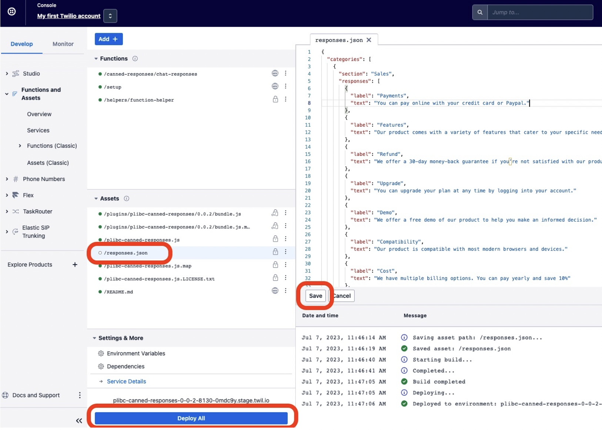

## Details
#### How it works
Plugin is ready to use once it is installed and canned responses are updated (see Installation steps below) and the browser window is refreshed.
- If rendered in the CRM Panel, agents have the ability to insert the message into the active task's text input (chat box) or send the message directly.
- If rendered in the Message Input Actions (popover from under the chat box), clicking a canned response will only populate the text input (chat box) with the response. There is no option to send the message.

#### Installation
- Click Install. In the install form, specify "CRM" or "MessageInputActions" as your preferred location for showing the canned responses.
- Click submit to initiate plugin installation. Once the plugin is installed, you will be notified.
- After receiving successful plugin install notification, head over to [Twilio Console > Functions and Assets > Services](https://console.twilio.com/us1/develop/functions/services)
- Click on service unique name that starts with "plibc-canned-responses"
- In the assets panel on the left, you will find a *responses.json*. This file lists default canned responses. 
- You can modify this file with canned responses that suit your business case. After modification, click *Save* and then *Deploy All*.

- After modifying the canned responses, agents will need to refresh their browser to see the changed canned responses.